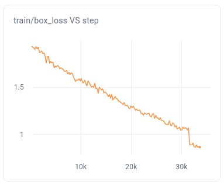
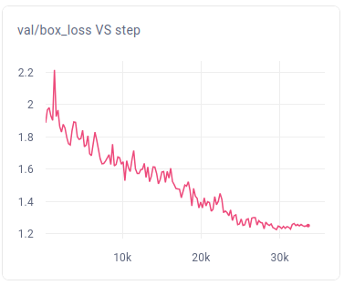
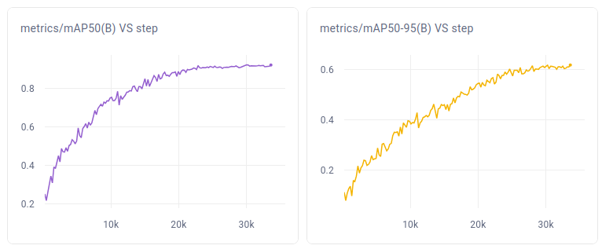
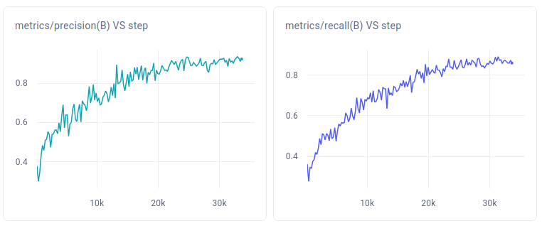
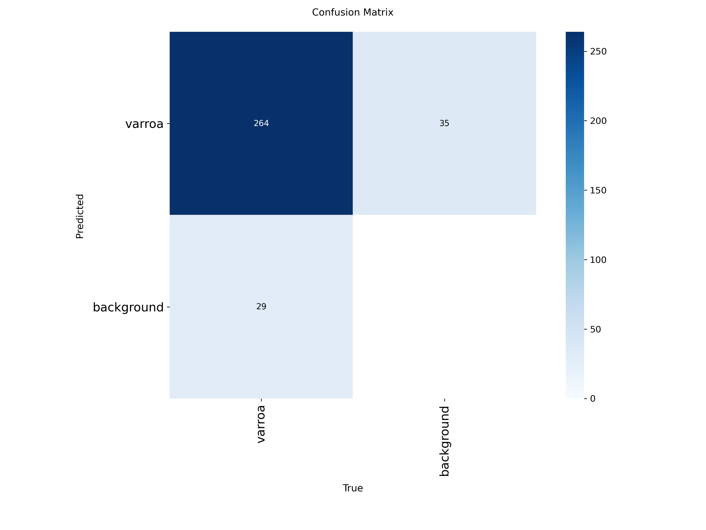
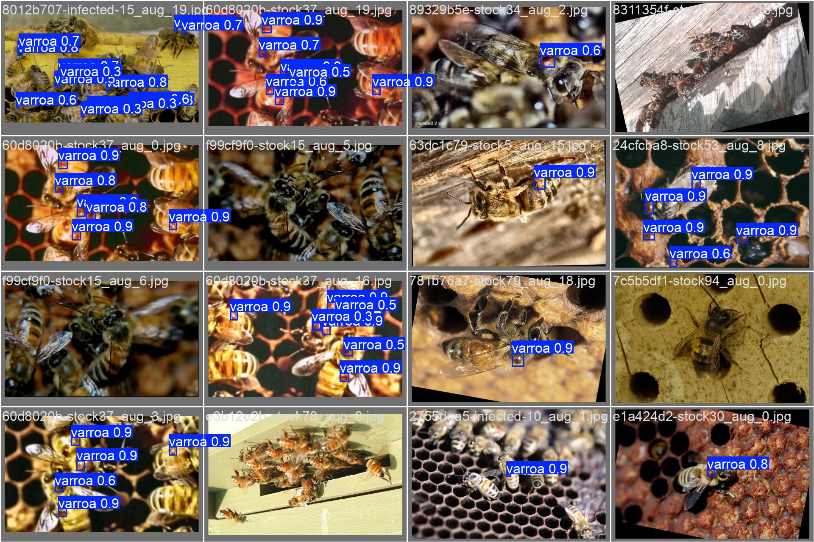
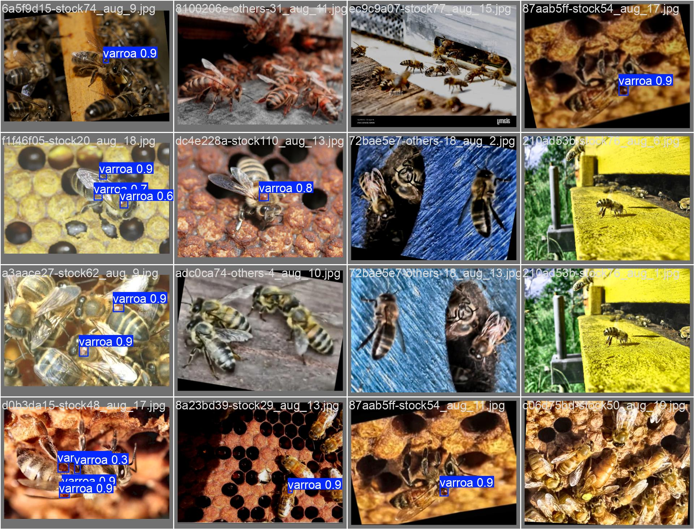

# Результаты проверки гипотезы H1  
**(Влияние полевого датасета на точность детекции Varroa)**

---

## 1. Описание эксперимента

В рамках проверки гипотезы H1 было проведено обучение модели детекции клеща Varroa на собственном датасете, собранном в полевых условиях (съёмка пчёл над летком).

**Цель:**  
Проверить, позволяет ли использование полевого датасета достичь высокой точности детекции (целевое значение mAP@0.5 ≥ 95%).

**Модель:**
- Архитектура: YOLO (yolo26n, fine-tuning)
- Параметры:
  - ~2.5M параметров  
  - 5.77 GFLOPs  

**Данные:**
- Собственный датасет (полевые условия)
- Разметка: bounding boxes клещей Varroa  
- Разделение: train / val / test  

---

## 2. Конфигурация обучения

```python
# ключевые параметры
imgsz = 640
batch = 8
epochs = 150
lr0 = 0.005
optimizer = "auto"

# аугментации
hsv_h = 0.015
hsv_s = 0.7
hsv_v = 0.4
degrees = 5.0
scale = 0.15
mosaic = 0.5
mixup = 0.05
copy_paste = 0.1
auto_augment = "randaugment"
```

Использовались агрессивные аугментации для повышения устойчивости модели к:

* вариативному освещению
* движению пчёл
* шумному фону

---

## 3. Динамика обучения

### Сходимость функции потерь

* train/box_loss: **1.93 → 0.86**
* train/cls_loss: **10.20 → 0.38**
* train/dfl_loss: **0.009 → 0.0036**

Наблюдается устойчивая сходимость модели.



---

### Валидационные потери

* val/box_loss: **~1.25**
* val/cls_loss: **~0.62**
* val/dfl_loss: **~0.007**



---

## 4. Основные метрики

| Метрика      | Значение  |
| ------------ | --------- |
| mAP@0.5      | **0.923** |
| mAP@0.5:0.95 | 0.618     |
| Precision    | 0.923     |
| Recall       | 0.860     |

📊 Графики:




---

## 5. Confusion Matrix



📌 Наблюдения:

* модель уверенно различает класс Varroa
* основная ошибка — пропуски мелких объектов

---

## 6. Визуализация предсказаний

### Примеры успешной детекции




---

### Ошибки модели

Типичные ошибки:

* мелкий размер клеща
* частичное перекрытие пчелой
* сложный фон

---

## 7. Анализ результатов

### Что удалось достичь:

* Достигнута высокая точность:

  * **mAP@0.5 ≈ 92.3%**

* Модель устойчива к:

  * вариативному освещению
  * шумному фону
  * положению пчёл

* Сходимость обучения стабильная

---

### Ограничения:

* Целевое значение (95%) не достигнуто
* Recall ниже precision → есть пропуски
* Основная проблема — детекция очень мелких объектов

---

### Ключевые выводы:

1. Использование полевого датасета **существенно повышает точность**
2. Задача детекции Varroa **принципиально решаема**
3. Основной bottleneck — **размер объекта и качество данных**
4. Для достижения 95% требуется:

   * расширение датасета
   * улучшение качества разметки
   * возможно использование более тяжёлых моделей

---

## 8. Итог по гипотезе H1

**Гипотеза подтверждена частично.**

✔ Доказано:

* полевой датасет позволяет достичь высокой точности (~92%)

✖ Не достигнуто:

* целевое значение 95%

Вывод:
гипотеза верна по направлению, но требует дальнейшего увеличения объёма и разнообразия данных.

---

## 9. Вывод для продукта

Полученные результаты подтверждают возможность создания системы автоматической детекции Varroa в реальных условиях, однако для достижения промышленного уровня точности требуется дальнейшее развитие датасета и моделей.


